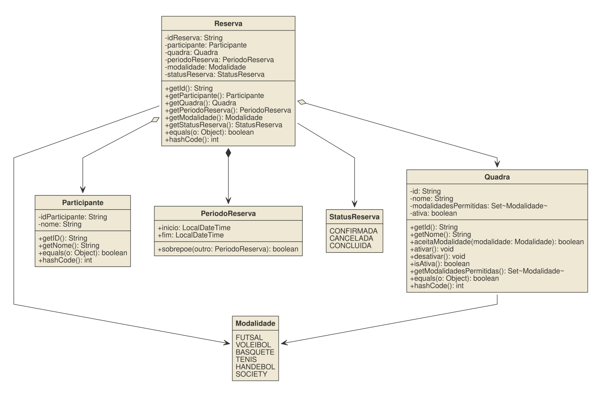

# Plataforma de Reservas
Aplicação Java para administrar reservas de recursos em um período,
desenvolvida na disciplina de Programação Orientada a Objetos (Fagammon, 2026/2).
## Equipe

- Integrante 1: Victor Henrique Rezende Andrade

## Problema

- Quadras esportivas são recursos disputados: duas pessoas não podem usar a mesma
  quadra no mesmo horário, e nem toda quadra comporta toda modalidade. O sistema
  cadastra participantes e quadras, e registra reservas respeitando essas regras.
## Variante

- Variante: Quadras Esportivas
- Regra específica: Compatibilidade de modalidade - cada quadra possui uma lista de modalidades permitidas; o sistema recusa reservas com modalidade incompatível.


## Diagrama de classes




## Requisitos atendidos (checkpoint 1)

- RF1 : cadastro e validação de Participante.
- RF2 : cadastro, ativação/desativação de Quadra.
- RF3 : Período como objeto de valor imutável, com validação de início/fim.
- RF4 : Reserva recusa quadra inativa e modalidade incompatível;
  detecção de sobreposição entre reservas fica para o checkpoint 2.
- Regra própria da variante: compatibilidade de modalidade implementada e testada.

## Como executar

```bash
./mvnw test
```

No Windows:

```powershell
.\mvnw.cmd test
```


## Documentação

- [Decisões do projeto](docs/decisoes.md)
- [Uso de IA](docs/IA_USAGE.md)